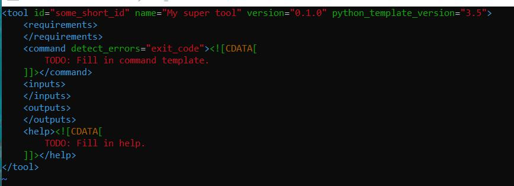

`planemo tool_init`命令
创建xml文件的基本骨架
```
$ mkdir new_tool #创建new_tool文件夹
$ cd new_tool
$ planemo tool_init --id 'some_short_id' --name 'My super tool'  #创建xml文件名为some_short_id, name为My super tool
```
该文件内容如下：

对于`planemo tool_init`更多的选项指令： 
```
planemo tool_init --id 'samtools_sort' 
				  --name 'Samtools sort' \
                  --description 'order of storing aligned sequences' \
                  --requirement 'samtools@1.3.1' \
                  --example_command "samtools sort -o '1_sorted.bam' '1.bam'" \
                  --example_input 1.bam \
                  --example_output 1_sorted.bam \
                  --test_case \
                  --version_command 'samtools --version | head -1' \
                 --help_from_command 'samtools sort' \
                  --doi '10.1093/bioinformatics/btp352'
```